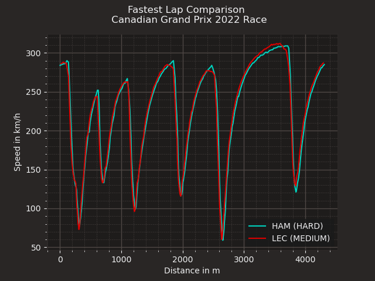

# INTRODUCTION 
This is a repository that contains f1 data analysis. The project was inspired by AWS F1 insights.

It is not as comprehensive as the official page and still needs some work. I hope to include sentiment analysis for the team radios(just because).

At the time of writing the fastf1 library works best on python version 3.8 and 3.9 .

## Race insights 
Insights in F1 serve to improve the viewing experience and overall enjoyment by enabling fans to tell how teams make split second decisions about strategic pit stops and driver ratings.


DISCLAIMER: This is not an official project and is not in any way related to the Formula 1 group.

# Usage 
Clone the repository
```shell 
git clone https://github.com/shawn-phy/f1fun.git
```
 and change directories to the f1projects
```shell
cd f1fun
```

Install the required pacakages 
``` shell
pip install -r requirements.txt
```
then run the project 
``` shell 
python fastestlap.py 
```

the first time you run the project it will take some time downloading all the cache. 


This is an example to show how it works

